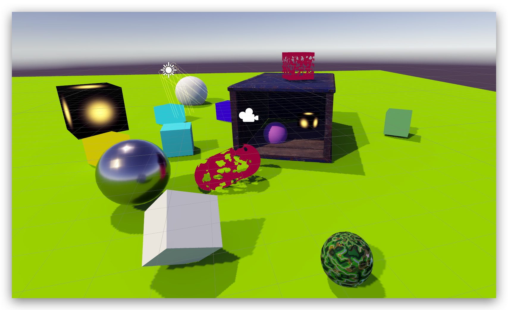
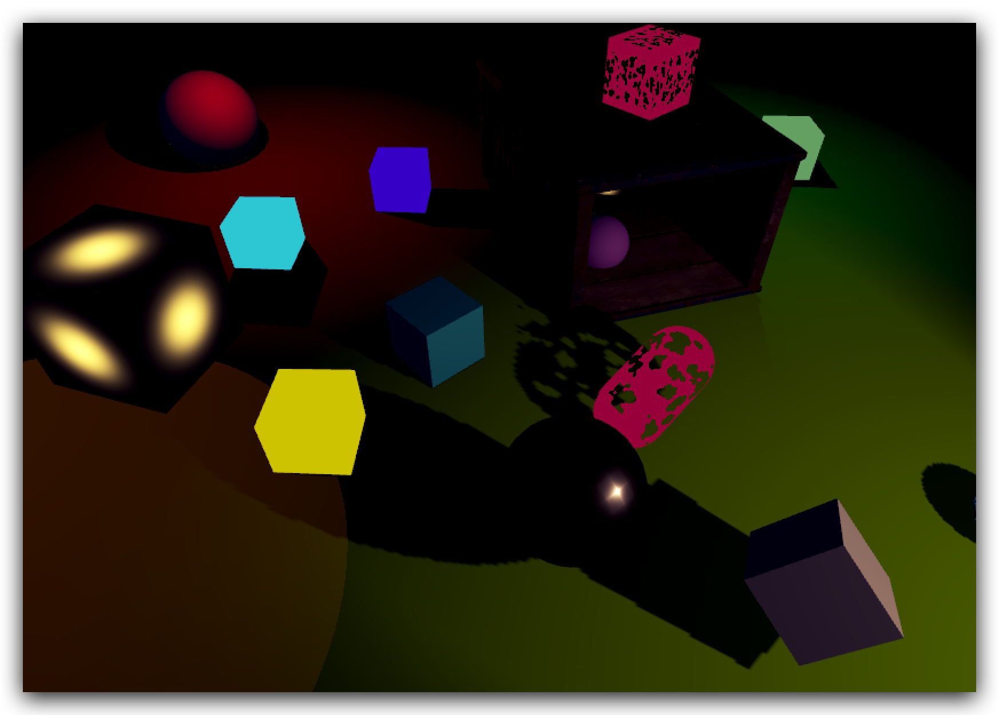
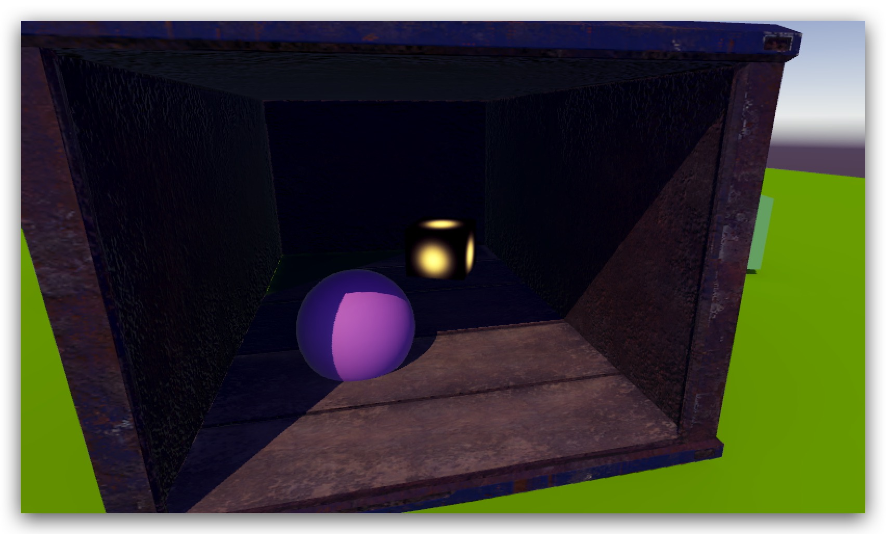
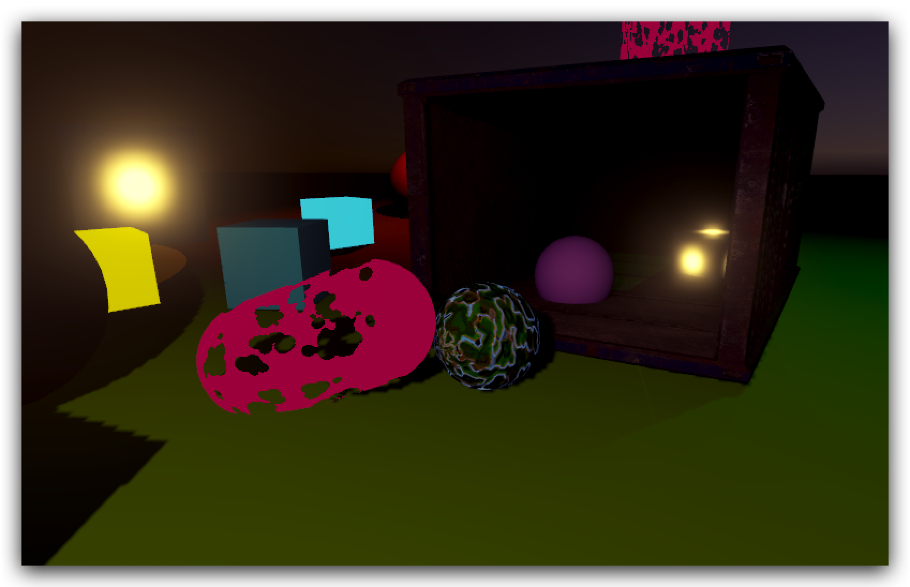
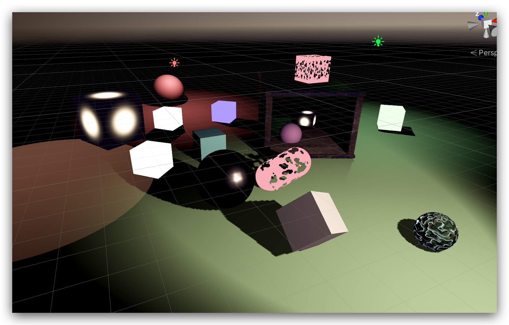

# Unity Custom SRP
> This is a unity single pass forward base lightweight custom rendering pipeline, using unity scriptable rendering pipeline.  Case it caculate all lightting/shadow in one rendering pass
, which is a rendering optimaztion for mobie device by reducing draw calls. It support up to 4 Shadowed run time directional lights,  16 up to 2 shadowed real time points, 16 up to 16 shadow 
real time spot lights, all shadows render to a single quad shadow alats. It support baked/mixed light and baked shadow, environment reflection , as knowed as global illumination. It support SRP
Batcher/Instancing drawing, HDR rendering and a simple post processing stack.

## Rendering Feature

### Single pass multible directional light/shadow

### Single pass multible point/spot light/shadow

### Global indirect lighting

### Post processing Bloom

### Post processing color ajustment

